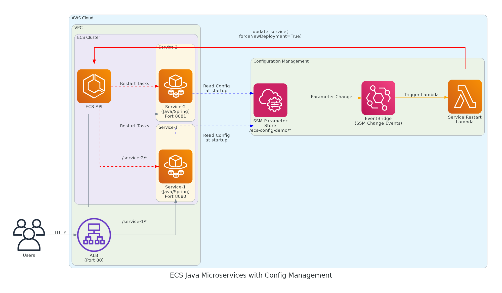

# ECS Java Microservices with Centralized Configuration Management

Managing configuration across multiple microservices quickly becomes painful:

- **Scattered property files** - Each service has its own `application.properties`, making it hard to see or change configuration across services
- **Redeployment required** - Changing a single property means rebuilding and redeploying the entire service
- **Environment drift** - Copy-paste errors lead to inconsistent configuration between dev, staging, and prod

This project is POC showing how these problems can be solved with **AWS SSM Parameter Store** and **automatic service restart**:

- **Single source of truth** - All configuration in one place, organized by environment and service
- **Automatic updates** - Change a parameter and ECS services restart automatically with new configuration
- **Terraform-managed** - Infrastructure-as-code with clear separation of common vs environment-specific settings. We can have predefined hierarchy when
environment configuration overrides common default values.
- **Zero-downtime deployments** - ECS gracefully restarts tasks with rolling updates
- **Full audit trail** - AWS CloudTrail tracks every parameter change



## Architecture

- **2 Spring Boot microservices** running on ECS Fargate
- **SSM Parameter Store** for centralized configuration (Terraform-managed)
- **EventBridge** watches for parameter changes
- **Lambda** triggers ECS service restart via AWS API (`forceNewDeployment`)
- **ECS** orchestrates graceful rolling restart of tasks
- **ALB** routes traffic based on path prefix with zero downtime during restarts
- **Spring Profiles** for environment-specific configuration

### Why Service Restart?

The solution uses **ECS service restart** instead of runtime refresh because:

- **Works with all Spring patterns** - @Value, @ConfigurationProperties, constructor injection
- **Fresh application state** - No stale caches, connections, or memory state
- **Zero-downtime** - ECS handles graceful rolling deployment
- **Guaranteed consistency** - All configuration loaded from startup, not just environment properties

Runtime refresh (`@RefreshScope`) only works with specific Spring patterns and doesn't reload infrastructure configs like database connections, thread pools, or security settings.

For demonstration purposes:

- **service-1** runs with `dev` profile
- **service-2** runs with `prod` profile

## SSM Parameter Structure

Parameters are organized by environment and service:

```
/ecs-config-demo/
├── dev/
│   ├── service-1/
│   │   └── app/
│   │       ├── name
│   │       ├── version
│   │       ├── environment
│   │       ├── feature/flag
│   │       └── log/level
│   └── service-2/
│       └── app/...
└── prod/
    ├── service-1/
    │   └── app/...
    └── service-2/
        └── app/...
```

Parameters are automatically converted to Spring properties:

| SSM Parameter Name                                  | Spring Property Name  |
|-----------------------------------------------------|-----------------------|
| `/ecs-config-demo/dev/service-1/app/feature/flag`   | `app.feature.flag`    |
| `/ecs-config-demo/dev/service-1/app/environment`    | `app.environment`     |
| `/ecs-config-demo/prod/service-2/app/log/level`     | `app.log.level`       |

## Configuration Management

Parameters are managed via Terraform in `infra/config/`:

```
infra/config/
├── modules/ssm-params/       # Reusable module for SSM creation
│   ├── main.tf
│   └── variables.tf
├── common/                   # Defaults for ALL environments
│   ├── common.tf            # Env-wide defaults (all services)
│   ├── service-1.tf         # Service-1 defaults
│   ├── service-2.tf         # Service-2 defaults
│   └── outputs.tf
├── dev/                      # Dev environment (standalone terraform root)
│   ├── main.tf              # Calls ssm-params module
│   ├── env.tf               # Dev env-wide params + services list
│   ├── service-1.tf         # Service-1 dev overrides
│   └── service-2.tf         # Service-2 dev overrides
└── prod/                     # Prod environment (standalone terraform root)
    ├── main.tf
    ├── env.tf
    ├── service-1.tf
    └── service-2.tf
```

### Parameter Hierarchy

Parameters are merged with the following priority (later overrides earlier):

| Priority | Source | Example | Description |
|----------|--------|---------|-------------|
| 1 (lowest) | `common/common.tf` | `app/log/level = INFO` | Default for all services in all envs |
| 2 | `common/service-X.tf` | `service-1/app/name = demo` | Default for specific service in all envs |
| 3 | `{env}/env.tf` | `app/log/level = DEBUG` | Override for all services in this env |
| 4 (highest) | `{env}/service-X.tf` | `service-1/app/log/level = TRACE` | Override for specific service in this env |

### Adding a New Environment

1. Create environment directory:
```bash
mkdir infra/config/staging
```

2. Copy structure from existing environment:
```bash
cp infra/config/dev/*.tf infra/config/staging/
```

3. Update `staging/env.tf`:
```hcl
locals {
  services = ["service-1", "service-2"]

  env_params = {
    "app/log/level"    = "INFO"
    "app/environment"  = "staging"
  }
}
```

4. Update `staging/main.tf` - change environment name:
```hcl
module "ssm_params" {
  source      = "../modules/ssm-params"
  environment = "staging"  # Change this
  # ...
}
```

5. Deploy:
```bash
cd infra/config/staging
terraform init && terraform apply
```

### Adding a New Service

1. Add service defaults in `common/service-3.tf`:
```hcl
locals {
  service_3_params = {
    "service-3/app/name"    = "service-3"
    "service-3/app/version" = "1.0.0"
  }
}
```

2. Update `common/outputs.tf` to include new service params

3. Add `service-3.tf` to each environment that needs it

4. Add `"service-3"` to `services` list in each env's `env.tf`

5. Add `local.service_3_params` to merge in each env's `main.tf`

## Prerequisites

- AWS CLI configured
- Terraform >= 1.0
- Java 21
- Maven
- Docker

## Quick Start

```bash
# Build framework, services, Docker images and push to ECR
./build.sh

# Deploy all infrastructure
./deploy.sh

# Destroy all resources
./destroy.sh
```

**Note:** Ensure `AWS_REGION` is set (defaults to `eu-west-1`) and AWS credentials are configured.

## Manual Deploy

<details>
<summary>Click to expand manual steps</summary>

### 1. Build Framework and Services

```bash
cd app/framework && mvn clean install
cd ../service-1 && mvn clean package -DskipTests
cd ../service-2 && mvn clean package -DskipTests
```

### 2. Push Docker Images

```bash
export AWS_REGION=eu-west-1
AWS_ACCOUNT=$(aws sts get-caller-identity --query Account --output text)

aws ecr get-login-password | docker login --username AWS --password-stdin $AWS_ACCOUNT.dkr.ecr.$AWS_REGION.amazonaws.com

cd app/service-1
docker build -t $AWS_ACCOUNT.dkr.ecr.$AWS_REGION.amazonaws.com/service-1 .
docker push $AWS_ACCOUNT.dkr.ecr.$AWS_REGION.amazonaws.com/service-1

cd ../service-2
docker build -t $AWS_ACCOUNT.dkr.ecr.$AWS_REGION.amazonaws.com/service-2 .
docker push $AWS_ACCOUNT.dkr.ecr.$AWS_REGION.amazonaws.com/service-2
```

### 3. Deploy Infrastructure

```bash
cd infra/platform && terraform init && terraform apply
cd ../config/dev && terraform init && terraform apply
cd ../prod && terraform init && terraform apply
cd ../../service-1 && terraform init && terraform apply
cd ../service-2 && terraform init && terraform apply
cd ../lambda-config-refresh && terraform init && terraform apply
```

### 4. Get ALB Endpoint

```bash
cd infra/platform
terraform output alb_endpoint
```

</details>

## Demo: Automatic Configuration Update

### Step 1: View Current Configuration

```bash
ALB=<your-alb-dns>

# View service-1 config (dev environment)
curl -s http://$ALB/service-1/api/config | jq

# View service-2 config (prod environment)
curl -s http://$ALB/service-2/api/config | jq
```

Notice the differences:

- **service-1 (dev)**: `feature.flag=true`, `log.level=DEBUG`
- **service-2 (prod)**: `feature.flag=false`, `log.level=INFO`

### Step 2: View SSM Properties

```bash
# See all SSM properties loaded by each service
curl -s http://$ALB/service-1/api/ssm-properties | jq
curl -s http://$ALB/service-2/api/ssm-properties | jq
```

### Step 3: Watch Automatic Service Restart

Open two terminals:

**Terminal 1 - Watch service-1 config:**

```bash
while true; do
  echo "=== $(date) ==="
  curl -s http://$ALB/service-1/api/config | jq '.application.featureFlag'
  sleep 5
done
```

**Terminal 2 - Change a parameter:**

```bash
aws ssm put-parameter \
  --name "/ecs-config-demo/dev/service-1/app/feature/flag" \
  --value "false" \
  --type String \
  --overwrite
```

Within 30-60 seconds, you'll see the configuration update. The flow is:

1. SSM Parameter changes
2. EventBridge detects the change
3. Lambda is triggered
4. Lambda calls ECS API: `update_service(forceNewDeployment=True)`
5. ECS starts new tasks with fresh configuration
6. ECS waits for new tasks to pass health checks
7. ECS gracefully stops old tasks
8. Service now running with updated configuration

**Monitor the ECS deployment:**

```bash
aws ecs describe-services \
  --cluster ecs-config-demo-cluster \
  --services ecs-config-demo-service-1 \
  --query 'services[0].deployments'
```

You'll see two deployments during the rollout: PRIMARY (new) and ACTIVE (old).

### Step 4: Update Configuration via Terraform

For persistent changes, update the Terraform config:

```bash
# Edit infra/config/dev/env.tf or service files to change values
# Then apply:
cd infra/config/dev
terraform apply
```

## API Endpoints

| Endpoint | Description |
|----------|-------------|
| `GET /service-1/api/config` | View service-1 configuration |
| `GET /service-2/api/config` | View service-2 configuration |
| `GET /service-{n}/api/ssm-properties` | View all SSM-loaded properties |
| `GET /service-{n}/api/health` | Health check |

## Manual Service Restart

If needed, you can manually trigger a service restart:

```bash
# Restart service-1
aws ecs update-service \
  --cluster ecs-config-demo-cluster \
  --service ecs-config-demo-service-1 \
  --force-new-deployment

# Restart service-2
aws ecs update-service \
  --cluster ecs-config-demo-cluster \
  --service ecs-config-demo-service-2 \
  --force-new-deployment
```

**Note:** The `/api/config/refresh` endpoint still exists in the code but is not used by the automatic configuration update flow. The ECS restart approach ensures all Spring configuration patterns work correctly.

## Cleanup

```bash
./destroy.sh
```
